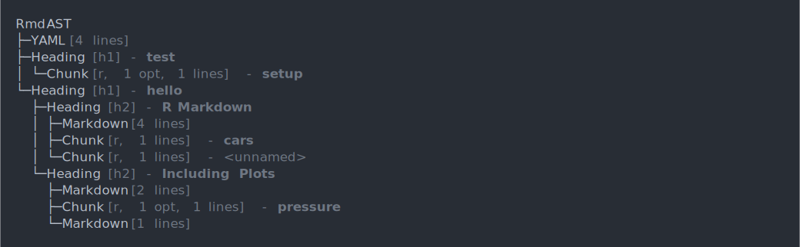
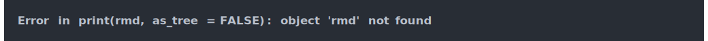

<!-- README.md is generated from README.Rmd. Please edit that file -->

parsermd
========

<!-- badges: start -->
<!-- badges: end -->

The goal of parsermd is to extract the content of an Rmarkdown file to
allow for programmatic interactions with the code chunks and markdown
contents.

Installation
------------

You can install the released version of parsermd from
[GitHub](https://github.com/rundel/parsermd) with:

    remotes::install_github("rundel/parsermd")

Example - Minimal
-----------------

This is a basic example which shows you the basic abstract syntax tree
(AST) that results from parsing a simple Rmd file,

    rmd = parsermd::parse_rmd(system.file("minimal.Rmd", package = "parsermd"))

    print(rmd)

    print(rmd, as_tree = FALSE)

Example - Student Work
----------------------
